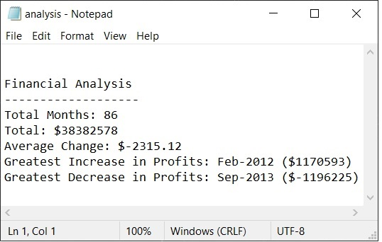
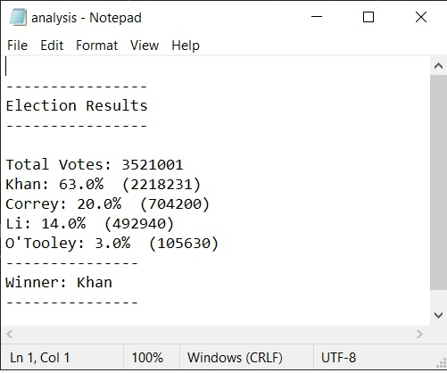

# Python Challenge - Py Me Up, Charlie
This two part project consists of analyzing two disparate datasets with basic python scripts. Tools used for this project consist of VS Code for text editing, GitBash for running code, and GitHub for version control. Dataset snippets for each project may be found in their respective "resources" directory for the project.
---
---
## Part I - PyBank

---
---
Using a csv file with columns for Date & Profit/Loss as laid out below, analyze and record the following:
---
_CSV Table Format_
| Date | Profit/Losses |
|----------|----------|
|Mon-YYYY|$ XXXXXX|
---
_Requested Analytical Output_
* Calculate total number of months included in dataset
* Calculate total "Profit/Loss" over period
* Calculate m/m change and output average m/m change for "Profit/Loss"
* Identify Date & Amount of greatest increase in "Profit/Loss"
* Identify Date & Amount of greatest decrease in "Profit/Loss"
* Print all output to terminal and text file in seperate "analysis" folder
---
_Results_

---
---
## Part II - PyPoll

---
---
Using an election dataset containing "Voter ID", "Candidate", and "County", analyze and record the following:
---
_CSV Table Format_
| Voter ID | County |Candidate|
|----------|----------|----------|
| 12345 | Clark | Drumpf | 
---
_Requested Analytical Output_
* Calculate total number of votes
* Generate a list of candidates that received votes
* Calculate percentage of the total vote that each candidate won
* Calculte the total number of votes that each candidate won
* Identify winner of the election based on popular vote
* Print all output to terminal and text file in seperate "analysis" folder
---
_Results_

>This readme is powered by [Bing Cherry Energy](https://bingbeverage.com/product/bing-cherry/)